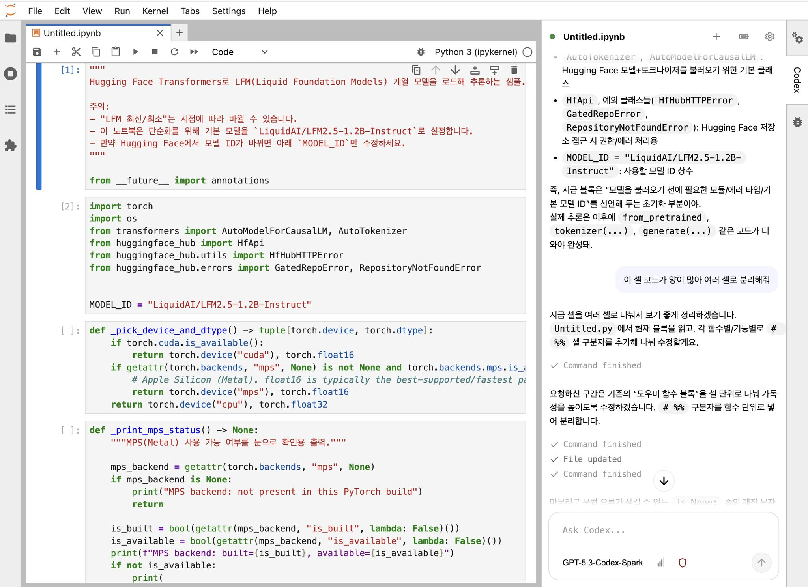

# JupyterLab Codex Sidebar



## English

### Quick Guide (Discovery Install, Read First)
Follow this order for the easiest setup.

1) Prerequisites
- Install the `Jupytext` JupyterLab extension first.
- Ensure `codex` CLI is installed and logged in.
  - Check in terminal: `codex exec --help` (or `codex exec`) works.

2) Install from JupyterLab Discovery (Extension Manager)
1. Open JupyterLab.
2. Open `Extensions` (puzzle icon) in the left sidebar.
3. Search `jupyterlab-codex-sidebar`.
4. Click `Install`.

3) Restart and verify
1. In JupyterLab menu, run `File > Shut Down`.
2. Start JupyterLab again.
3. Confirm `Codex` appears in the right sidebar.

4) Create Jupytext pairs (`.ipynb` <-> `.py`)
- This extension requires a Jupytext paired workflow.

### A. Start from `.ipynb`
1. Open the notebook.
2. In the `Jupytext` menu, choose `Pair Notebook with ...`.
3. Select `.py`.
4. Confirm a same-name `.py` file exists.

### B. Start from `.py` (reverse direction)
1. Open the `.py` file as a notebook (`Open With > Notebook`, etc.).
2. In the `Jupytext` menu, choose `Pair Notebook with ...`.
3. Select `.ipynb`.
4. Confirm a same-name `.ipynb` file exists.

Note: For Codex sidebar usage, the paired `.ipynb` and `.py` should both exist with the same base name.

A JupyterLab 4 sidebar extension that connects to Codex CLI (`codex exec --json`) and provides a chat-style assistant UI.

The extension has two parts:
- Frontend: JupyterLab prebuilt extension (React)
- Backend: Jupyter Server extension (WebSocket at `/codex/ws`)

The backend runs `codex` as a local subprocess per request, streams JSONL events, and renders them in the UI.

## Features
- Threaded sessions by notebook path
- Model / Reasoning Effort / Sandbox selection in the UI
- Optional inclusion of active cell text
- Designed for a Jupytext paired workflow (`.ipynb` <-> `.py`)
  - execution is disabled if the paired `.py` file is missing
- Conversation/session logs: `~/.jupyter/codex-sessions/`
- Optional usage snapshot: best-effort scan of recent `~/.codex/sessions/`

## Requirements
- Python 3.9+
- JupyterLab 4 and Jupyter Server
- Codex CLI installed and authenticated (`codex exec` works in terminal)
- Node.js + `jlpm` + `jupyter labextension` for source build

## Install / Run

### Quick start (recommended for local development)
There are two development workflows:

- `install_dev.sh` : install/link only (does not start JupyterLab)
- `run_dev.sh` : install first, then start JupyterLab

Install only:

```bash
bash install_dev.sh
```

Install + run:

```bash
bash run_dev.sh --ServerApp.port=8888
```

`run_dev.sh` internally runs `install_dev.sh` first.

### Manual local install
1. Build frontend

```bash
jlpm install
jlpm build
```

2. Install Python package

```bash
python -m pip install -e .
```

3. Enable server extension

```bash
PREFIX="${CONDA_PREFIX:-$(python -c 'import sys; print(sys.prefix)')}"
mkdir -p "$PREFIX/etc/jupyter/jupyter_server_config.d"
cp jupyter-config/jupyter_server_config.d/jupyterlab_codex.json \
  "$PREFIX/etc/jupyter/jupyter_server_config.d/jupyterlab_codex.json"

jupyter server extension enable jupyterlab_codex --sys-prefix || true
jupyter server extension list | sed -n '1,120p' || true
```

4. Link labextension in editable mode

```bash
PREFIX="${CONDA_PREFIX:-$(python -c 'import sys; print(sys.prefix)')}"
mkdir -p "$PREFIX/share/jupyter/labextensions"
ln -sfn "$(pwd)/jupyterlab_codex/labextension" "$PREFIX/share/jupyter/labextensions/jupyterlab-codex-sidebar"
jupyter labextension list
```

5. Start JupyterLab

```bash
jupyter lab
```

## Usage
1. Open a notebook in JupyterLab.
2. The `Codex` panel appears in the right sidebar.
3. Send messages and the server runs `codex exec --json ...` and streams output.
4. Settings controls:
- Auto-save before send
- Include active cell
- Include active cell output
- Model / Reasoning Effort / Permission

## Configuration
Server-side defaults can also be set via environment variables:
- `JUPYTERLAB_CODEX_MODEL`: default model when unset in UI/command
- `JUPYTERLAB_CODEX_SANDBOX`: default sandbox (default: `workspace-write`)
- `JUPYTERLAB_CODEX_SESSION_LOGGING`: `0`/`1` to disable/enable local session logging (default: `1`)
- `JUPYTERLAB_CODEX_SESSION_RETENTION_DAYS`: retention period for local session logs in days (default: `30`; set `0` to disable pruning)
- `JUPYTERLAB_CODEX_SESSION_MAX_MESSAGE_CHARS`: max length per stored message, used for local logs (default: `12000`)

Notes:
- Session logs are stored under `~/.jupyter/codex-sessions/` as JSONL+meta JSON.
- Before writing each message, obvious secret-like values are redacted (e.g., API keys, bearer tokens, JWT-like strings).
- You can disable logs entirely by setting `JUPYTERLAB_CODEX_SESSION_LOGGING=0`.

Selected UI values are passed as CLI args.

## Paths
- WebSocket endpoint: `/codex/ws`
- Session logs: `~/.jupyter/codex-sessions/*.jsonl` and `*.meta.json`
- Usage snapshot: best-effort scan of recent `~/.codex/sessions/**/*.jsonl`

## Troubleshooting
- Sidebar missing:
  - Check `jupyter labextension list` includes `jupyterlab-codex-sidebar`
  - In editable install, confirm symlink is created
- WebSocket stays `disconnected`:
  - Check `jupyter server extension list` shows `jupyterlab_codex` enabled
  - Inspect server logs for errors
- `codex` command not found:
  - Verify `codex exec --help` works in terminal
  - Recheck PATH/virtualenv and restart JupyterLab

## Development notes
- `jlpm watch` enables auto rebuild
- Main files:
  - UI: `src/panel.tsx`
  - Server: `jupyterlab_codex/handlers.py`, `jupyterlab_codex/runner.py`

## Architecture
```
[UI (JupyterLab Sidebar)]
   |
   | WebSocket: /codex/ws
   v
[CodexWSHandler (Jupyter Server)]
   |
   v
[CodexRunner]
  - subprocess: codex exec --json --color never --skip-git-repo-check ...
   |
   v
[UI rendering]
```

## Korean

# JupyterLab Codex 사이드바

### 빠른 가이드 (Discovery 설치, 먼저 읽기)
아래 순서대로 하면 가장 쉽게 설정할 수 있습니다.

1) 사전 준비
- `Jupytext` JupyterLab extension이 먼저 설치되어 있어야 합니다.
- 터미널에서 `codex` CLI가 설치되어 있고, 로그인된 상태여야 합니다.
  - 확인: `codex exec --help` (또는 `codex exec`) 가 정상 동작

2) JupyterLab Discovery(Extension Manager)에서 설치
1. JupyterLab 실행
2. 왼쪽 사이드바 `Extensions`(퍼즐 아이콘) 열기
3. `jupyterlab-codex-sidebar` 검색
4. `Install` 클릭

3) 재시작 후 확인
1. JupyterLab 상단 메뉴에서 `File > Shut Down` 실행
2. JupyterLab 재실행
3. 우측 사이드바에 `Codex` 패널이 보이는지 확인

4) Jupytext 페어링 만들기 (`.ipynb` <-> `.py`)
- 이 확장은 Jupytext 페어링 워크플로우를 전제로 합니다.

### A. `.ipynb` 파일에서 시작할 때
1. 노트북(`.ipynb`) 열기
2. 상단 `Jupytext` 메뉴에서 `Pair Notebook with ...` 선택
3. `.py` 포맷으로 페어링
4. 같은 이름의 `.py` 파일이 생성되었는지 확인

### B. `.py` 파일에서 시작할 때 (반대 방향)
1. `.py` 파일을 Notebook 형태로 열기(`Open With > Notebook` 등)
2. 상단 `Jupytext` 메뉴에서 `Pair Notebook with ...` 선택
3. `.ipynb` 포맷으로 페어링
4. 같은 이름의 `.ipynb` 파일이 생성되었는지 확인

참고: Codex 사이드바 사용 시에는 같은 이름의 `.ipynb`와 `.py` 페어가 모두 있어야 합니다.

JupyterLab 4 우측 사이드바에서 Codex CLI(`codex exec --json`)를 채팅 UI로 사용할 수 있게 해주는 확장입니다.

구성은 아래 2개로 나뉩니다.
- 프론트엔드: JupyterLab prebuilt 확장(React)
- 백엔드: Jupyter Server 확장(WebSocket: `/codex/ws`)

백엔드는 요청마다 로컬의 `codex` 실행 파일을 서브프로세스로 호출하고(JSONL 이벤트 스트리밍), UI가 이를 받아 채팅처럼 렌더링합니다.

## 주요 기능
- 노트북 경로 기준으로 스레드(세션) 분리
- 모델 / Reasoning Effort / 샌드박스 권한을 UI에서 선택
- 활성 셀 텍스트를 프롬프트에 포함할지 선택
- `.ipynb` ↔ `.py`(Jupytext paired) 워크플로우를 전제로 동작(페어링된 `.py`가 없으면 실행이 비활성화됨)
- 세션 로그 저장: `~/.jupyter/codex-sessions/`
- (가능한 경우) Codex 사용량 스냅샷 표시: `~/.codex/sessions/` 를 best-effort로 스캔

## 요구 사항
- Python 3.9+
- JupyterLab 4 / Jupyter Server
- Codex CLI 설치 및 인증 완료(터미널에서 `codex exec`가 동작해야 함)
- (소스에서 빌드 시) Node.js + `jlpm` + `jupyter labextension` 명령 사용 가능

## 설치/실행
### 빠른 실행(권장)
개발용 스크립트가 분리되어 있습니다.

- `install_dev.sh` : 설치/링크만 수행 (`jupyter lab` 실행 없음)
- `run_dev.sh` : 설치 후 JupyterLab 실행

설치만:

```bash
bash install_dev.sh
```

설치 + 실행:

```bash
bash run_dev.sh --ServerApp.port=8888
```

`run_dev.sh`는 내부적으로 `install_dev.sh`를 먼저 실행한 뒤 JupyterLab을 시작합니다.

스크립트가 하는 일(요약):
- JS 의존성 설치(`jlpm install`) 및 빌드(`jlpm build`)
- 파이썬 패키지 editable 설치(`python -m pip install -e .`)
- 서버 확장 활성화용 config 스니펫 설치 + enable
- labextension을 현재 파이썬 환경의 `share/jupyter/labextensions/`에 symlink
- `jupyter lab` 실행

추가로 JupyterLab 옵션을 넘기고 싶다면, 스크립트 뒤에 그대로 붙이면 됩니다.

```bash
bash run_dev.sh --ServerApp.port=8888
```

### 수동 설치(개발/로컬)
1) 프론트엔드 빌드

```bash
jlpm install
jlpm build
```

2) 파이썬 패키지 설치

```bash
python -m pip install -e .
```

3) 서버 확장 활성화(최초 1회)

```bash
PREFIX="${CONDA_PREFIX:-$(python -c 'import sys; print(sys.prefix)')}"
mkdir -p "$PREFIX/etc/jupyter/jupyter_server_config.d"
cp jupyter-config/jupyter_server_config.d/jupyterlab_codex.json \
  "$PREFIX/etc/jupyter/jupyter_server_config.d/jupyterlab_codex.json"

# 필요 시(또는 확인용)
jupyter server extension enable jupyterlab_codex --sys-prefix || true
jupyter server extension list | sed -n '1,120p' || true
```

4) labextension 링크(Editable 설치에서 필요)

```bash
PREFIX="${CONDA_PREFIX:-$(python -c 'import sys; print(sys.prefix)')}"
mkdir -p "$PREFIX/share/jupyter/labextensions"
ln -sfn "$(pwd)/jupyterlab_codex/labextension" "$PREFIX/share/jupyter/labextensions/jupyterlab-codex-sidebar"
jupyter labextension list
```

5) JupyterLab 실행

```bash
jupyter lab
```

## 사용 방법
1) JupyterLab을 실행한 뒤 노트북을 열면, 우측 사이드바에 `Codex` 패널이 나타납니다.
2) 메시지를 입력하고 전송하면 서버가 `codex exec --json ...` 를 실행하고 결과를 스트리밍합니다.
3) Settings에서 아래 옵션을 조정할 수 있습니다.
- Auto-save before send: 전송 전에 노트북을 자동 저장
- Include active cell: 활성 셀 텍스트를 프롬프트에 포함
- Include active cell output: 활성 셀 output(텍스트 위주)을 프롬프트에 포함
- Model / Reasoning Effort / Permission(샌드박스)

## 설정(옵션)
서버 측 기본값은 환경 변수로도 지정할 수 있습니다.
- `JUPYTERLAB_CODEX_MODEL`: 모델을 명시하지 않았을 때 기본 모델로 사용
- `JUPYTERLAB_CODEX_SANDBOX`: 샌드박스 기본값(기본: `workspace-write`)
- `JUPYTERLAB_CODEX_SESSION_LOGGING`: `0`/`1`로 세션 로그 저장 비활성/활성화 (기본: `1`)
- `JUPYTERLAB_CODEX_SESSION_RETENTION_DAYS`: 로컬 세션 로그 보관 기간(일 단위, 기본: `30`; `0`으로 두면 보존 정리 비활성)
- `JUPYTERLAB_CODEX_SESSION_MAX_MESSAGE_CHARS`: 저장되는 메시지 최대 길이(기본: `12000`)

안내:
- 세션 로그는 `~/.jupyter/codex-sessions/*.jsonl` 및 `*.meta.json`에 저장됩니다.
- 로그 저장 전 메시지 내 민감해 보이는 값(토큰/키/암호류)을 마스킹합니다.
- 로그가 불필요하다면 `JUPYTERLAB_CODEX_SESSION_LOGGING=0`으로 끌 수 있습니다.

참고: UI에서 모델/권한을 명시적으로 선택하면, 해당 값이 요청에 포함되어 CLI 인자로 전달됩니다.

## 데이터/경로
- WebSocket 엔드포인트: `/codex/ws`
- 세션 로그: `~/.jupyter/codex-sessions/*.jsonl` 및 `*.meta.json`
- 사용량 스냅샷(best-effort): `~/.codex/sessions/**/*.jsonl` 의 최근 로그를 일부 스캔

## 트러블슈팅
- 사이드바가 보이지 않음:
  - `jupyter labextension list` 에서 `jupyterlab-codex-sidebar`가 잡히는지 확인
  - editable 설치라면 “labextension 링크” 단계가 빠졌는지 확인
- WebSocket이 `disconnected`로만 표시됨:
  - `jupyter server extension list` 에서 `jupyterlab_codex`가 enabled인지 확인
  - 서버 로그에 에러가 없는지 확인
- `codex` 실행 파일을 찾지 못함:
  - 터미널에서 `codex exec --help` 가 동작하는지 확인
  - PATH/가상환경을 정리한 뒤 JupyterLab 서버를 재시작

## 개발 메모
- `jlpm watch`: 프론트엔드 자동 빌드/갱신
- 주요 코드 위치:
  - UI: `src/panel.tsx`
  - 서버: `jupyterlab_codex/handlers.py`, `jupyterlab_codex/runner.py`

## 아키텍처(요약 플로우)
```
[UI (JupyterLab Sidebar)]
   |
   | WebSocket: /codex/ws
   v
[CodexWSHandler (Jupyter Server)]
   |
   v
[CodexRunner]
  - subprocess: codex exec --json --color never --skip-git-repo-check ...
   |
   v
[UI 출력 렌더링]
```
